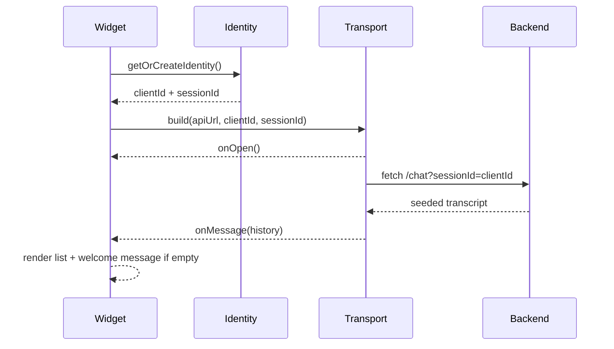
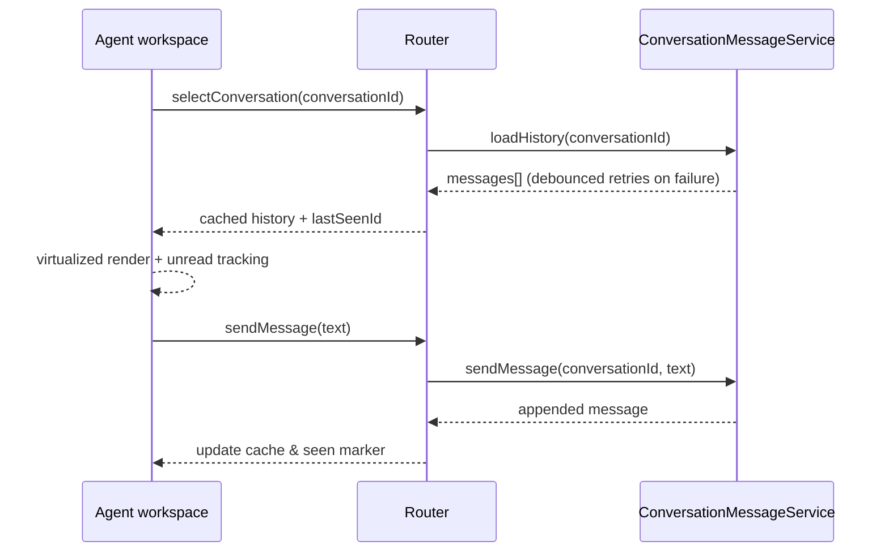

# Bacon Architecture Overview

This project ships a pluggable transport and plugin system designed for enterprise-ready deployments. The transport layer abstracts message delivery between the chat widget and backend, while the plugin layer injects cross-cutting behaviors such as logging, tracing, and authentication refresh.

## Transports
- **PollingTransport**: Default, fetch-based transport with lifecycle signals, exponential backoff, jitter, and optional long-polling. Suitable for environments without WebSocket support.
- **WebSocketTransport**: Persistent transport with reconnection logic and telemetry hooks for real-time scenarios. Can fall back to polling when sockets are blocked.

Both transports expose consistent lifecycle states (`idle`, `connecting`, `open`, `closed`, `error`) and allow subscribers to react via event handlers.

## Plugin System
`BaconPlugin` defines hooks that run before sending/receiving messages and during UI lifecycle. Plugins are isolated and ordered to prevent cascading failures. Example plugins include structured logging, distributed tracing, and token refreshers.

## Backend Package
`packages/bacon-backend` offers a reusable `createBaconServer` factory that wraps Express/Fastify adapters and can run in serverless environments. It provides shared types, health/readiness endpoints, logging/metrics hooks, and pluggable storage adapters.

## Example App
`/apps/example` demonstrates transport selection (WebSocket vs polling) and plugin usage. The app highlights how to configure backend URLs, supply authentication headers, and visualize connection status.

## Operational Notes
- Prefer infrastructure automation for provisioning databases and observability stacks.
- Enable TLS and WAF protections in production, with rate limiting at the edge.
- Centralize logging/metrics and alert on transport errors or elevated reconnect rates.
- Regularly run the CI suite to validate transports, plugins, and backend integrations before releasing.

## Chat feed and session lifecycles

The client identity manager stores the `clientId`/`sessionId` pairing in both `localStorage` and a SameSite cookie. On reconnects (tab restores, network blips) the widget rehydrates the values and threads them through every transport payload so backend CSRF/abuse controls remain intact even when transports switch from polling to WebSocket.
